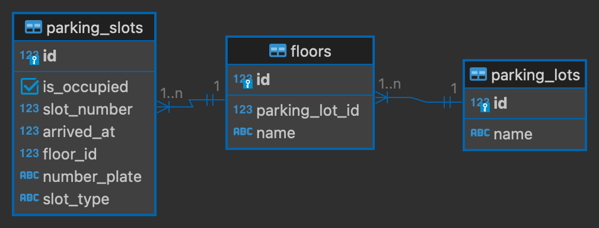

# Parking management system

## Prerequisites

Before you begin, ensure you have the following software installed:

- [Node.js](https://nodejs.org/): Make sure you have Node.js installed. You can download it from [nodejs.org](https://nodejs.org/).
- [npm](https://www.npmjs.com/): Node.js typically includes npm, but make sure it's available in your environment.

### Installation

## Configuration

1. Clone the repository:

   ```shell
   git clone https://github.com/akxhay/parking_node.git
   ```

2. Open the project in your favorite IDE (e.g., WebStorm, VS code).

3. Configure PostgresSQL Database:
   * Create a PostgresSQL database with your preferred name (e.g., parking_management).
    * Update the database connection properties in app/config/database.js:

   ```shell
   const databaseName = "parking_management"
   const userName = "username"
   const password = "password"
   const host = "localhost"
   const port = 5432
   const dialect = "postgres"
   ```

4. Build and Run
   ```shell
   npm install
   ```
    ```shell
    node app.js
    ```
5. The application should start, and you can access the following APIs.

## Database design ERD


## APIs

### Create 1200 Dummy parking lots

```shell
curl --location 'http://localhost:8080/parking/lot/dummy' \
--header 'Accept: application/json' \
--header 'Content-Type: application/json' \
--data '{
  "parkingLots": 1200,
  "floorsPerParkingLot": 3,
  "smallSlotsPerFloor": 100,
  "mediumSlotsPerFloor": 100,
  "largeSlotsPerFloor": 100,
  "xlargeSlotsPerFloor": 100
}'
```

> Success Response: Dummy parking lots created successfully

### Create a parking lot

```shell
curl --location 'http://localhost:8080/parking/lot' \
--header 'Content-Type: application/json' \
--data '{
    "name": "My parking lot",
    "floors": [
        {
            "name": "My floor 1",
            "smallSlots": 1,
            "mediumSlots": 1,
            "largeSlots": 1,
            "xlargeSlots": 1
        }
    ]
}'
```

> Success Response:

```json
{
   "id": 1202,
   "name": "My parking lot",
   "floors": [
      {
         "id": 3603,
         "name": "My floor 1",
         "parkingSlots": [
            {
               "id": 1440009,
               "slotType": "s",
               "slotNumber": 1,
               "numberPlate": null,
               "arrivedAt": null,
               "occupied": false
            },
            {
               "id": 1440010,
               "slotType": "m",
               "slotNumber": 1,
               "numberPlate": null,
               "arrivedAt": null,
               "occupied": false
            },
            {
               "id": 1440011,
               "slotType": "l",
               "slotNumber": 1,
               "numberPlate": null,
               "arrivedAt": null,
               "occupied": false
            },
            {
               "id": 1440012,
               "slotType": "xl",
               "slotNumber": 1,
               "numberPlate": null,
               "arrivedAt": null,
               "occupied": false
            }
         ]
      }
   ]
}
````

> Failure Response: Parking lot is already present with this name

### Fetch all parking lots

 ```shell
curl --location 'http://localhost:8080/parking/lot?pageNumber=0&pageSize=1'
```

> Success Response:

```json
{
   "totalPages": 1201,
   "totalElements": 1201,
   "parkingLots": [
      {
         "id": 1202,
         "name": "My parking lot",
         "floors": [
            {
               "id": 3603,
               "name": "My floor 1",
               "parkingSlots": [
                  {
                     "id": 1440009,
                     "slotType": "s",
                     "slotNumber": 1,
                     "numberPlate": null,
                     "arrivedAt": null,
                     "occupied": false
                  },
                  {
                     "id": 1440010,
                     "slotType": "m",
                     "slotNumber": 1,
                     "numberPlate": null,
                     "arrivedAt": null,
                     "occupied": false
                  },
                  {
                     "id": 1440011,
                     "slotType": "l",
                     "slotNumber": 1,
                     "numberPlate": null,
                     "arrivedAt": null,
                     "occupied": false
                  },
                  {
                     "id": 1440012,
                     "slotType": "xl",
                     "slotNumber": 1,
                     "numberPlate": null,
                     "arrivedAt": null,
                     "occupied": false
                  }
               ]
            }
         ]
      }
   ]
}
````

> Failure Response: { "totalPages": 13, "totalElements": 1201, "parkingLots": [] }

### Delete parking lot

```shell
curl --location --request DELETE 'http://localhost:8080/parking/lot/{parking_lot_id}'
```

> Success Response: Parking lot deleted successfully

> Failure Response: Parking Slot was not deleted

### Get parking slot

> size: s : small, m : medium, l : large, xl :x-large

 ```shell
curl --location 'http://localhost:8080/parking/getslot/{parking_lot_id}/{size}' \
--header 'Accept: application/json' \
--header 'Content-Type: application/json' \
--header 'numberPlate: ABED1234' \
--header 'arrivedAt: 1698063736'
````

> Success Response:

```json
{
   "slotId": 1440010,
   "slotType": "m",
   "slotNumber": 1,
   "floorId": 3603,
   "floorName": "My floor 1",
   "numberPlate": "ABED1234",
   "arrivedAt": 1698063734
}
````

```text
Failure Response: 
   Car is already parked
   Please find parking information below
   Parking Lot Name: My parking lot
   floor Name: My floor 1
   Slot Type: m
   Slot Number: 1
```

### Release parking slot

 ```shell
curl --location --request PUT 'http://localhost:8080/parking/releaseslot/{parking_lot_id}/{slot_id}' \
--header 'Accept: application/json' \
--header 'Content-Type: application/json'
```

> Success Response: Parking slot freed successfully

> Failure Response: Parking Slot could not be released

Thank you. 😄